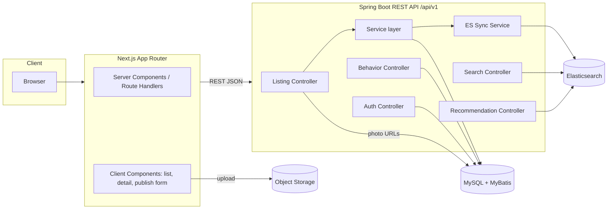

# Architecture — Used Car Platform MVP

## Overview

A front-end/back-end separated marketplace. Next.js (TS + Tailwind) renders the UI and calls a Spring Boot REST API. MySQL is the system of record (via MyBatis); Elasticsearch is a derived read store powering search, filtering, popular, and recommendation queries. Object storage holds listing photos.

## Components

### Frontend (Next.js, App Router)
- **Server Components** for list and detail pages (SEO + perf; server-side data fetch from BE).
- **Client Components** for the publish form, filter controls, and behavior event emission.
- **API client** (`/lib/api`) — typed fetch wrapper, base URL from env, attaches session cookie and auth token.
- **Recommendation strip** component reused on listing page (top) and detail page ("You may also like") — AC-016.
- No business logic in components beyond presentation (per architecture rules); scoring/filtering happens in BE.

### Backend (Spring Boot)
- **Auth module** — seller registration/login, JWT issuance, password hashing (BCrypt). (AC-001, AC-002)
- **Listing module** — CRUD, ownership checks, publish lifecycle. (AC-003, AC-005, AC-006, AC-009)
- **Search module** — query ES with filter composition + pagination. (AC-007, AC-008)
- **Behavior module** — record view/search events; dedupe + trim. (AC-010, AC-011)
- **Recommendation module** — popular + personalized rule-based scoring. (AC-012, AC-013, AC-014)
- **ES Sync service** — on listing create/update/delete/publish, upsert/remove ES document via Spring `@TransactionalEventListener` (AFTER_COMMIT). (AC-004, AC-005, AC-006)

### Data stores
- **MySQL** — sellers, listings, photos, view_events, search_events. Source of truth.
- **Elasticsearch** — `listings` index (denormalized doc for search + popularity counters fed from aggregation).
- **Object storage** — S3-compatible (or local FS in dev); stores photo binaries, URLs persisted in MySQL.

## Data flow

### Publish flow (AC-003, AC-004)
1. Seller submits form → FE uploads photos to object storage (or BE proxy) → gets URLs.
2. FE `POST /api/v1/listings` with attributes + photo URLs.
3. BE validates, writes MySQL row (`status=published`), commits.
4. AFTER_COMMIT event → ES Sync upserts document → searchable within 5s.

### Search flow (AC-007, AC-008)
1. FE `GET /api/v1/listings?keyword=&priceMin=&...&page=`.
2. Search controller builds ES bool query (must: keyword multi_match; filter: range/term clauses).
3. Returns paginated hits; MySQL not hit on read path.

### Behavior + recommendation flow (AC-010–AC-014, AC-016)
1. On detail view, FE `POST /api/v1/behavior/view`; on search, `POST /api/v1/behavior/search`.
2. BE persists events keyed by `session_id` (cookie) and optional `user_id`.
3. Recommendation controller composes: recent session views/searches → derive preferred attributes → ES query for similar listings; blend with popular (7-day view aggregation); exclude already-viewed.
4. FE renders strip at top of listing page and section in detail page.

## Interfaces

See `api-design.md` for full contract. All endpoints under `/api/v1/`, JSON, documented via springdoc-openapi. CORS allows FE origin (AC-015).

## Recommendation scoring (rule-based, A-007)

`score(candidate) = w1*attrMatch + w2*popularity + w3*recencyOfMatchSignal`

- `attrMatch` = normalized overlap on make/model (exact), price band (±20%), city, body/fuel.
- `popularity` = min-max normalized 7-day view count.
- Default weights: `w1=0.5, w2=0.3, w3=0.2` (configurable in `application.yml`).
- Cold start (no history) → popularity only (AC-014).
- Sparse history → ensure ≥ 30% slots from popular (AC-013).
- Exclude session-viewed car_ids; cap result at 10.

## AC coverage map

| AC ID | Design section |
|-------|----------------|
| AC-001 | Components §Auth; api-design §Auth |
| AC-002 | Components §Auth; api-design §Auth |
| AC-003 | Data flow §Publish; api-design §Listings |
| AC-004 | Data flow §Publish; §ES Sync service |
| AC-005 | §ES Sync service; api-design §Listings PUT |
| AC-006 | §ES Sync service; api-design §Listings DELETE/unpublish |
| AC-007 | Data flow §Search; api-design §Search |
| AC-008 | Data flow §Search; §Search module |
| AC-009 | Components §Listing; api-design §Listings GET by id |
| AC-010 | Data flow §Behavior; data-model view_events |
| AC-011 | Data flow §Behavior; data-model search_events |
| AC-012 | §Recommendation scoring (popularity); api-design §Recommendations |
| AC-013 | §Recommendation scoring (personalized) |
| AC-014 | §Recommendation scoring (cold start) |
| AC-015 | §Interfaces; api-design §Conventions |
| AC-016 | FE §Recommendation strip; api-design §Recommendations |

## Tech versions (pinned, R-008)

- Next.js 15 (App Router), TypeScript 5.x, Tailwind CSS 3.x
- Java 21 (LTS), Spring Boot 3.3.x, MyBatis-Spring-Boot-Starter 3.x
- MySQL 8.x, Elasticsearch 8.x
- Build: pnpm (FE), Maven (BE); local orchestration via docker-compose
