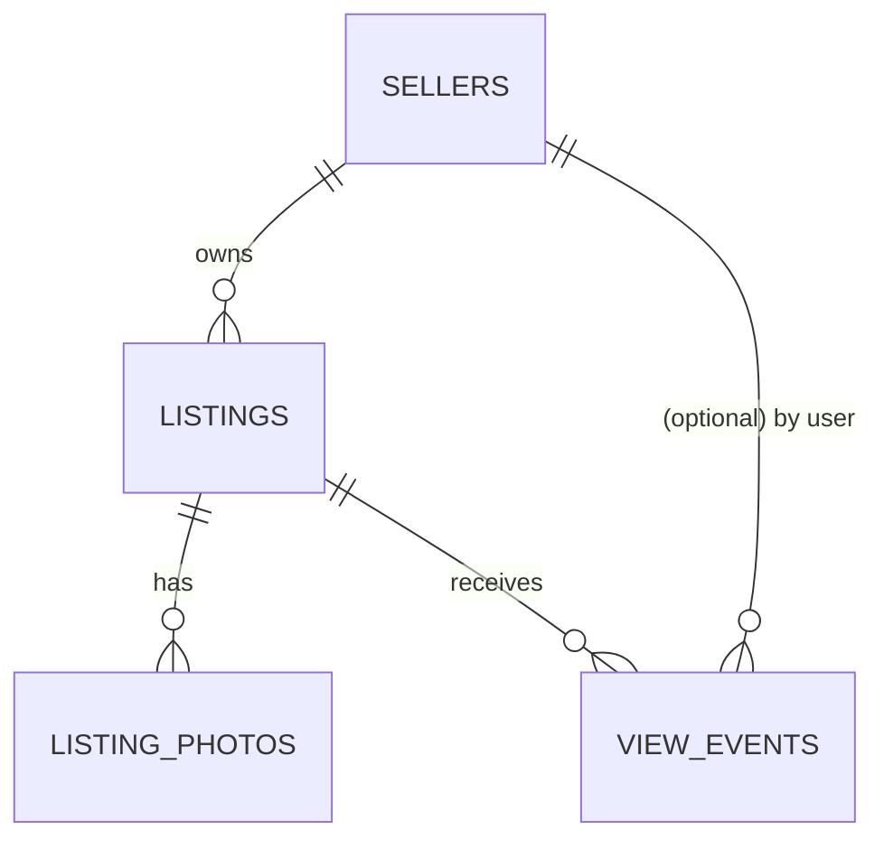

# Data Model — used-car-mvp

## MySQL (system of record)

### sellers (AC-001, AC-002)
| Column | Type | Notes |
|--------|------|-------|
| id | BIGINT PK AUTO_INCREMENT | |
| email | VARCHAR(255) UNIQUE NOT NULL | |
| password_hash | VARCHAR(100) NOT NULL | BCrypt |
| display_name | VARCHAR(100) | |
| created_at | DATETIME | |

### listings (AC-003–AC-009)
| Column | Type | Notes |
|--------|------|-------|
| id | BIGINT PK | |
| seller_id | BIGINT FK → sellers.id | |
| title | VARCHAR(200) NOT NULL | |
| price | DECIMAL(12,2) NOT NULL | RMB |
| make | VARCHAR(50) | |
| model | VARCHAR(50) | |
| year | SMALLINT | |
| mileage | INT | km |
| fuel_type | VARCHAR(20) | enum: GASOLINE/HYBRID/EV/DIESEL |
| transmission | VARCHAR(20) | enum: AUTOMATIC/MANUAL |
| city | VARCHAR(50) | |
| description | TEXT | |
| status | VARCHAR(20) | DRAFT/PUBLISHED/UNPUBLISHED/DELETED |
| published_at | DATETIME NULL | set on first publish |
| created_at | DATETIME | |
| updated_at | DATETIME | |

Indexes: `(status, published_at)`, `(seller_id)`.

### listing_photos
| Column | Type | Notes |
|--------|------|-------|
| id | BIGINT PK | |
| listing_id | BIGINT FK | |
| url | VARCHAR(500) | |
| sort_order | INT | |

### view_events (AC-010)
| Column | Type | Notes |
|--------|------|-------|
| id | BIGINT PK | |
| session_id | VARCHAR(64) | from cookie |
| user_id | BIGINT NULL | if logged in |
| car_id | BIGINT FK → listings.id | |
| created_at | DATETIME | |

Index: `(session_id, car_id, created_at)` for 5-min dedupe; `(car_id, created_at)` for popularity.

### search_events (AC-011)
| Column | Type | Notes |
|--------|------|-------|
| id | BIGINT PK | |
| session_id | VARCHAR(64) | |
| user_id | BIGINT NULL | |
| keyword | VARCHAR(200) NULL | |
| filters_json | JSON | serialized filter params |
| created_at | DATETIME | |

Retention: keep latest 20 per session (trim on insert).

## Elasticsearch — `listings` index (AC-004, AC-007, AC-008, AC-012, AC-013)

Mapping (key fields):
```json
{
  "mappings": {
    "properties": {
      "id":          { "type": "long" },
      "title":       { "type": "text", "fields": { "kw": { "type": "keyword" } } },
      "make":        { "type": "keyword" },
      "model":       { "type": "keyword" },
      "year":        { "type": "integer" },
      "price":       { "type": "double" },
      "mileage":     { "type": "integer" },
      "fuelType":    { "type": "keyword" },
      "transmission":{ "type": "keyword" },
      "city":        { "type": "keyword" },
      "status":      { "type": "keyword" },
      "thumbnailUrl":{ "type": "keyword", "index": false },
      "publishedAt": { "type": "date" },
      "viewCount7d": { "type": "integer" }
    }
  }
}
```

- Only `PUBLISHED` listings are indexed (unpublish/delete removes doc — AC-006).
- `viewCount7d` refreshed by a scheduled job aggregating `view_events` (feeds AC-012 popularity); recommendation popularity can also query view_events directly for freshness.
- Sync trigger: AFTER_COMMIT application event on listing write (AC-004, AC-005).

## Entity relationships



## Consistency model (R-001, R-004)

- MySQL authoritative; ES eventually consistent (< 5s target).
- Reconciliation: nightly/full reindex command for demo recovery.
- Reads for search/recommendation hit ES; writes always go MySQL first.
